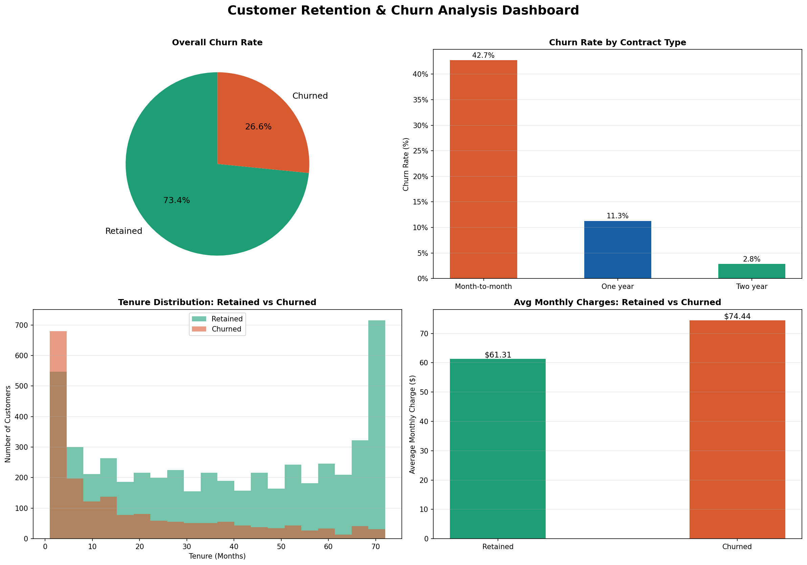

# Task 2 - Customer Retention & Churn Analysis
## Future Interns | Data Science & Analytics Track

## Overview
Analyzed real Telco customer data from Kaggle to identify 
churn patterns, key retention drivers, and actionable 
recommendations to reduce customer loss.

## Tools Used
- Python (Pandas, Matplotlib, NumPy)
- Google Colab
- GitHub for version control

## Dataset
- Source: Telco Customer Churn (Kaggle)
- 7,043 real customer records
- Includes contract type, tenure, charges and churn status

## Key Insights
- Overall churn rate: 26.5%
- Month-to-Month contracts churn at dramatically higher rates
- Churned customers had significantly shorter tenure
- Higher monthly charges correlate with increased churn risk

## Recommendations
1. Convert Month-to-Month customers to longer contracts
2. Offer loyalty discounts in first 12 months
3. Review pricing for high monthly charge customers
4. Build an early warning system for at-risk customers

## Challenges Faced
- TotalCharges stored as string — converted to numeric
- Blank TotalCharges rows required careful handling
- Choosing the right chart type for tenure distribution

## What I Learned
- How to handle real telecom data with messy fields
- How to identify strongest drivers of customer churn
- How to visualize distributions using histograms
- How to translate churn patterns into business strategy

## Files
- Task2_Churn_Analysis_V2.ipynb — Full analysis notebook
- churn_dashboard_v2.png — Professional 4-chart dashboard

